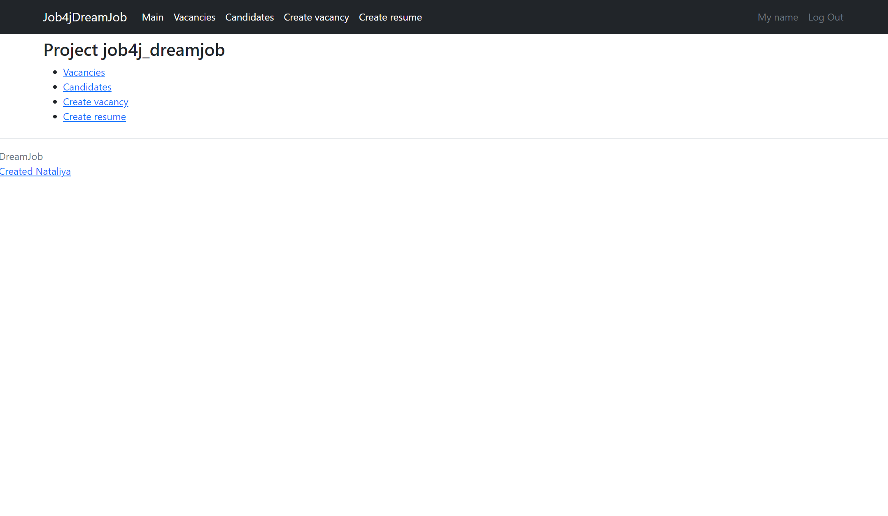
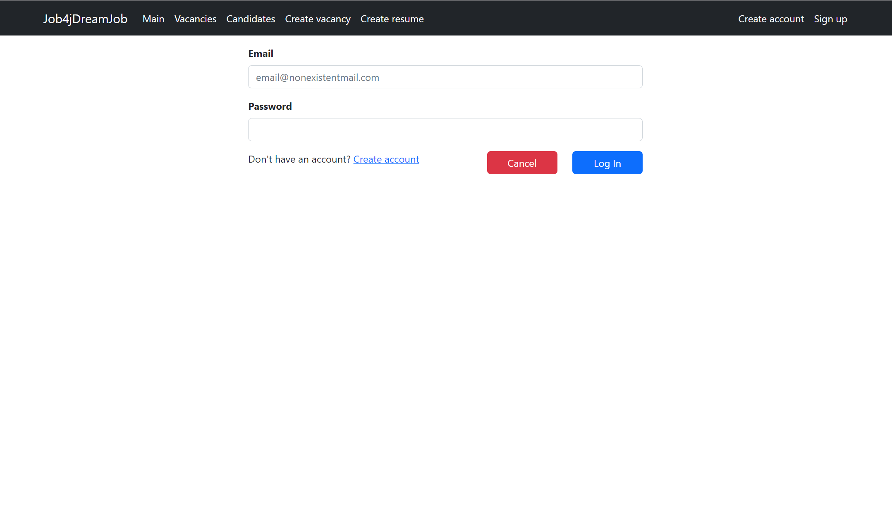
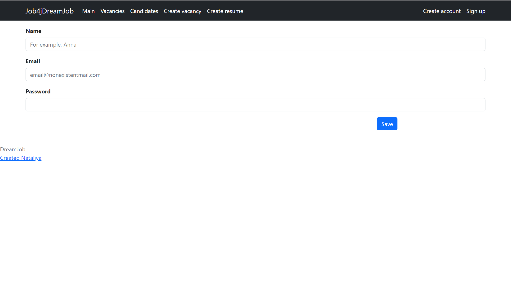
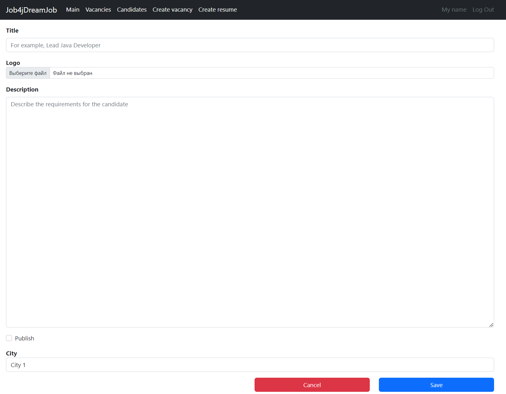
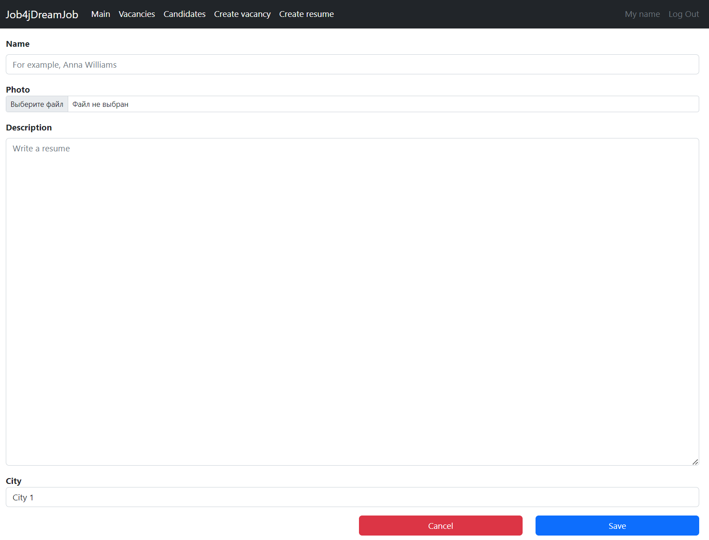
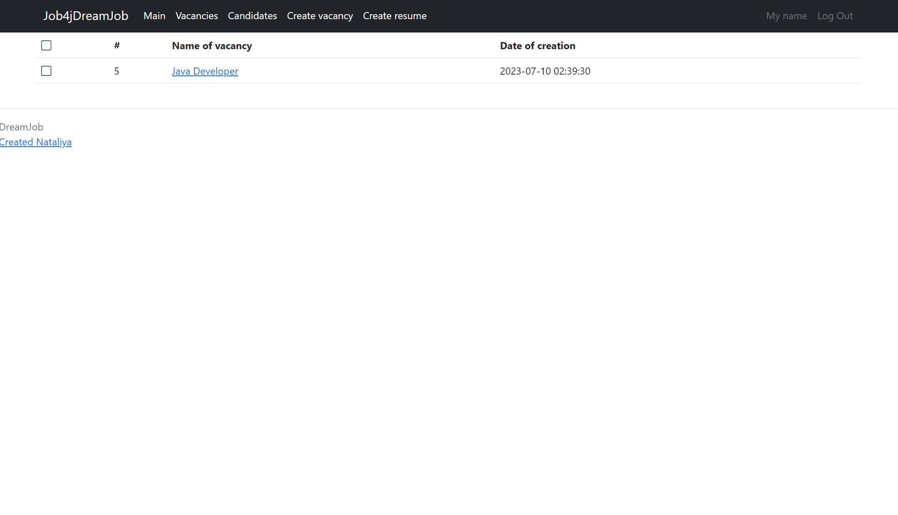
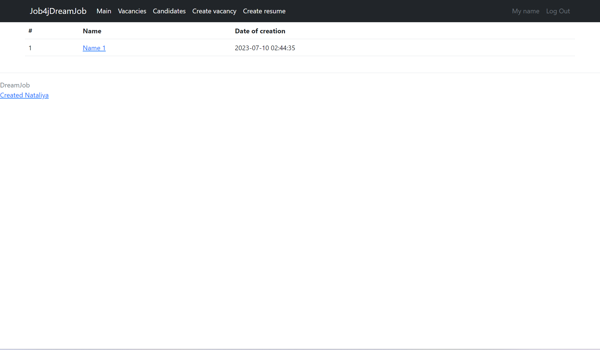

# job4j_dreamjob

+ [Project description](#Project-description)
+ [Technology stack](#Technology-stack)
+ [Environment requirements](#Environment-requirements)
+ [How to run the application](#How-to-run-the-application)
+ [How to stop the application](#How-to-stop-the-application)
+ [Application interaction](#Application-interaction)
____
### Project description
The system contains two models: vacancies and candidates.
After creating an account and logging in, candidates can post resumes and HR can post jobs.

### Technology stack

* Java 17
* PostgreSQL 14.5
* Spring Boot 3.1.1
* Thymeleaf
* Liquibase 4.15.0
* Checkstyle Plugin 3.1.2

### Environment requirements

* Java 17
* Apache Maven 3.8.6
* PostgreSQL 14.5
* Git (If you will use the `git clone` command in the first paragraph [How to run the application](#How-to-run-the-application))

### How to run the application

1. Use the command in console:

   `git clone https://github.com/nataliya-nataliya/job4j_dreamjob.git`

    or download project: [Download Zip](https://github.com/nataliya-nataliya/job4j_dreamjob/archive/refs/heads/master.zip)
2. Create database:
   `create database dreamjob;`
3. Specify the username and password from DBMS PostgreSQL in the file [application.properties](src/main/resources/application.properties) and [liquibase.properties](db/liquibase.properties)
4. Run all scripts from the folder: [db/scripts/](db/scripts)
5. Use the command in console to run:
   `mvn spring-boot:run`
6. Navigate to http://localhost:8080/index in a browser

### How to stop the application
Use console and press the keys:
`Ctrl + C` or `Ctrl + Break` or `Ctrl + Z`

### Application interaction
1. Main page:

____
2. Login page

____
3. Registration page

____
4. Vacancy creation page

____
5. Resume creation page

____
6. Vacancies list page

____
7. Candidates list page

____
